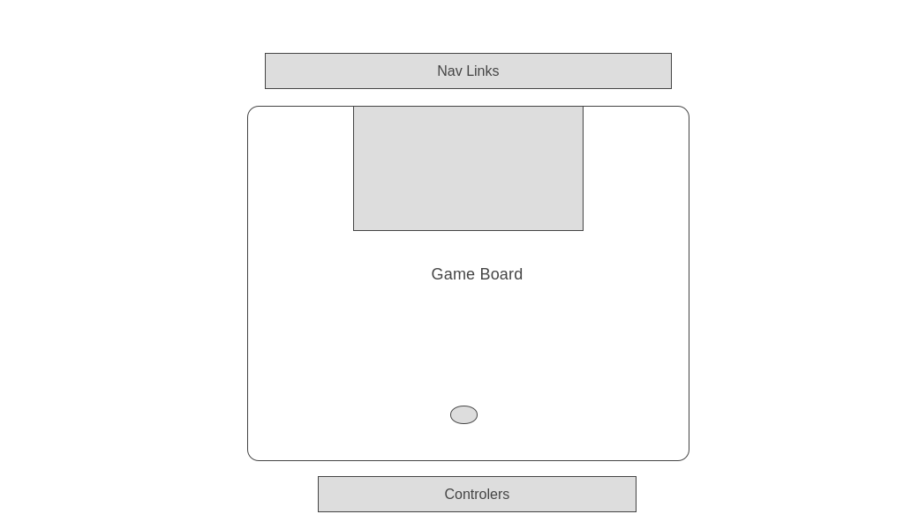

# JS Project Proposal: Penalty Shootout Game
# Background 
#### Penalty Shoutout is a part of soccer game when two teams finish the game with a draw, they play a round of penalty shootout each team has five attempts and the team who scores more win the game, this project will be about this part. A player will have six attempts to score against a goalkeeper who will try to catch the ball by moving randomly to the left or right side. To win the game, the player should score all the attempts

## Functionality & MVPs
### In this game, users will be able to:
     1. Control the shoot power
     2. Control the ball direction using the arrow keys 
### In addition, this project will include: 
     1. A production README 
     2. An About modal describing the game rules 
# Wireframes 

    1. Nav links include links to this project's Github repo, my LinkedIn and AngelList, and the About modal.
    2. Game controls will include a slider to control the power and the shooting will be performed using mouse click.

# Technologies, Libraries, APIs
## this project will be implemeneted with the following technologies 
    1. Canvas API to render the game board, ball, player, goalkeeper.
    2. Webpack to bundle JavaScript code 
    3. npm to manage project dependencies

# Implementation Timeline
## Friday Afternoon & Weekend
Setup the environment and read more documentation about Canvas API and creating the game board, soccer ball, player, and goalkeeper classes. be able to render something on the screen by the end of Sunday.
## Monday
This day will be about building the logic behind the game and be able to make the ball move from a starting position to an ending position with controlled speed.
## Tuesday
If didn't get what I’m hoping for I will continue and make sure I will make it work, and I will work also on the controllers.
## Wednesday
Finish implementing user controls and making the goalkeeper move randomly and stops the ball, also finishing up all the styling needed.
## Thursday Morning
Deploy to GitHub.
